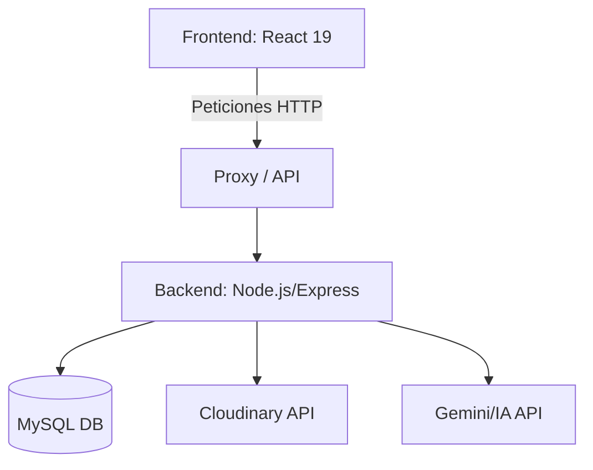

# 🌿 BioMon ADI - Gestión de Biodiversidad Forestal

Sistema profesional para el monitoreo de reforestación, gestión de voluntarios y reportes comunitarios, diseñado para llevar el seguimiento forestal a un estándar *enterprise-ready*.

---

## 🏗️ Arquitectura del Sistema
El proyecto sigue una arquitectura full-stack moderna:
- **Frontend:** React 19 con Vite, utilizando un diseño premium basado en Vanilla CSS y Glassmorphism.
- **Backend:** Node.js con Express, utilizando Sequelize como ORM para la persistencia de datos.
- **Base de Datos:** MySQL para el almacenamiento de datos relacionales.
- **Almacenamiento:** Cloudinary para la gestión de imágenes de reportes y perfiles.



---

## 🛠️ Stack Tecnológico

### Frontend
- **Framework:** React 19
- **Build Tool:** Vite
- **Mapas:** Leaflet & React Leaflet
- **Testing:** Vitest + React Testing Library + MSW
- **Estilos:** Vanilla CSS (Modular)

### Backend
- **Runtime:** Node.js
- **Framework:** Express
- **ORM:** Sequelize
- **Autenticación:** JWT + Bcrypt
- **Documentación:** Swagger (OpenAPI 3.0)
- **Testing:** Jest + Supertest

---

## 🚀 Instalación y Configuración

### Requisitos Previos
- Node.js (v18+)
- MySQL Server

### 1. Configuración del Backend
```bash
cd backend
npm install
```
Crea un archivo `.env` basado en `.env.example` y configura tus credenciales de MySQL y Cloudinary.

Levantar el servidor:
```bash
npm run dev
```
Acceder a la documentación: `http://localhost:3000/api-docs`

### 2. Configuración del Frontend
```bash
cd frontend/ReacProyecto
npm install
npm run dev
```

---

## 🤖 Capacidades de IA
El sistema integra **Gemini AI** para:
- Análisis de estado de árboles basado en descripciones de voluntarios.
- Sugerencia de cuidados preventivos y detección de plagas.

---

## 🛡️ Calidad y Testing
- **Unit/Integration Tests:** Ejecuta `npm test` en las carpetas de frontend y backend.
- **E2E Testing:** Playwright (en proceso de implementación).
- **Seguridad:** Implementación de Helmet.js y Rate Limiting para protección de la API.

---

## 🐳 Docker
Para levantar todo el entorno con un solo comando:
```bash
docker-compose up --build
```
*(Requiere Docker instalado)*
