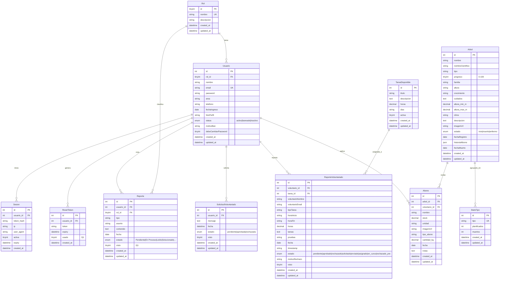
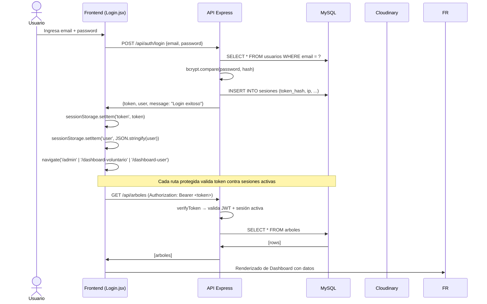

# Arquitectura del Proyecto — BioMon ADI (Reforestación)

> **Proyecto:** `Proyecto-final-fullstack`  
> **Dominio:** Sistema de monitoreo forestal y gestión de voluntariado  
> **Autorizado:** Equipo BioMon ADI — La Angostura  
> **Última actualización:** 2026-05-22

---

## 1. Resumen General

### Propósito del Sistema

**BioMon ADI** es una plataforma web fullstack para el monitoreo y gestión de un **corredor biológico de reforestación**. Permite a administradores registrar y dar seguimiento a árboles, gestionar usuarios con roles diferenciados, administrar solicitudes de voluntariado, emitir reportes y manejar un inventario de abonos aplicados a árboles.

### Goal Arquitectónico

Brindar una experiencia SPA moderna con dashboards diferenciados por rol, comunicación segura JWT entre frontend/backend, persistencia MySQL con Sequelize ORM y un modelo escalable de múltiples actores (visitante, usuario, voluntario, admin).

### Arquitectura General

El sistema sigue una **arquitectura en capas monolitica modular** (frontend + backend en repositorio único, diferenciacióndirectorio), con división clara de responsabilidades en ambos extremos y una **API REST** como contrato de comunicación.

```mermaid
flowchart TD
    subgraph Frontend["🌐 Frontend (React 19 + Vite)"]
        direction TB
        Pages["Pages / Dashboards por Rol"]
        Components["Componentes Organizados por Dominio"]
        Hooks["Hooks Compartidos (Loading, Form, Access, Paginación)"]
        Context["Context API (Theme, Loading)"]
        Services["Services Layer (fetch + axios)"]
        Utils["Utilidades (permissions, errors)"]
    end

    subgraph ReverseProxy["🔌 Vite Dev Proxy"]
        direction TB
        Proxy["Proxy /api → localhost:3005"]
    end

    subgraph Backend["⚙️ Backend (Express 5 + Sequelize)"]
        direction TB
        Routes["Rutas REST /api/*"]
        Middlewares["Middlewares (Auth, CORS, RateLimit, ErrorHandler)"]
        CRUDs["CRUD Controllers (arbol, usuario, reporte, abono, ...)"]
        Models["Modelos Sequelize (10 tablas)"]
        Validators["Validadores express-validator"]
        Utils_Backend["Utilidades (pagination, responseHelper, cloudinary)"]
    end

    subgraph Database[(🗄️ MySQL + Cloudinary)]
        direction TB
        MySQL["MySQL (reforestacion)"]
        Cloudinary["Cloudinary (imágenes)"]
    end

    Pages --> Hooks
    Pages --> Services
    Pages --> Context
    Components --> Hooks
    Components --> Services
    Hooks --> Context
    Services --> Proxy
    Proxy --> Routes
    Routes --> Middlewares
    Middlewares --> CRUDs
    CRUDs --> Models
    Routes --> Validators
    CRUDs --> Utils_Backend
    Models --> MySQL
    Utils_Backend --> Cloudinary

    class Frontend fill:#e1f5fe,stroke:#01579b
    class Backend fill:#f1f8e9,stroke:#33691e
    class Database fill:#fff3e0,stroke:#e65100
    class ReverseProxy fill:#f3e5f5,stroke:#6a1b9a
```

---

## 2. Stack Tecnológico

### 2.1 Frontend

| Tecnología           | Versión     | Propósito                                | Ubicación                      |
|----------------------|-------------|------------------------------------------|-------------------------------|
| React                | 19.2.0      | Framework UI principal                   | `frontend/ReacProyecto/`       |
| Vite                 | 7.3.1       | Build tool y dev server con HMR          | `vite.config.js`               |
| React Router DOM     | 7.13.1      | Enrutamiento SPA                         | `src/routes/Rooting.jsx`       |
| TanStack React Query | 5.100.10    | Estado del servidor, caché, mutaciones   | `src/main.jsx`                 |
| TailwindCSS          | 4.3.0       | Utility-first CSS framework              | `src/styles/`                  |
| Axios                | 1.16.1      | Cliente HTTP (utilizado en `arboles`)    | `src/services/apiClient.js`    |
| Fetch API            | Nativo      | Cliente HTTP (mayoría de servicios)     | `src/services/*.service.jsx`   |
| SweetAlert2          | 11.26.23    | Toasts y modales de confirmación         | En componentes                 |
| Framer Motion        | 12.38.0     | Animaciones de UI                        | Componentes de visitante       |
| Lucide React         | 0.577.0     | Iconos                                   | Todos los componentes          |
| Recharts             | 3.8.1       | Gráficos de analytics/R                   | `ResumenTab.jsx`               |
| React-Leaflet        | 5.0.0       | Mapas interactivos                       | `src/components/common/`       |
| EmailJS              | 4.4.1       | Envío de correos de recuperación de pwd  | `MainPagesLogin.jsx`           |
| Vitest               | 4.1.6       | Framework de testing                     | `frontend/ReacProyecto/`       |

### 2.2 Backend

| Tecnología           | Versión     | Propósito                              | Ubicación                    |
|----------------------|-------------|----------------------------------------|-----------------------------|
| Node.js              | —           | Runtime del servidor                   | `backend/src/server.js`      |
| Express              | 5.2.1       | Framework HTTP                         | `backend/src/app.js`         |
| Sequelize            | 6.37.8      | ORM para MySQL                         | `backend/src/models/`        |
| MySQL2               | 3.22.3      | Driver de base de datos                | `config/config.js`           |
| bcryptjs             | 2.4.3       | Hashing de contraseñas                 | Modelo `Usuario.js`          |
| JSONWebToken (JWT)   | 9.0.2       | Tokens de autenticación sin estado     | `cruds/authCrud.js`          |
| Helmet               | 8.1.0       | Headers HTTP de seguridad              | `app.js`                     |
| CORS                 | 2.8.6       | Politicas de cross-origin              | `app.js`                     |
| express-rate-limit   | 8.5.2       | Limitación de peticiones               | `middlewares/rateLimitMiddleware.js` |
| express-validator    | 7.3.2       | Validación de entrada                  | `validators/`                |
| Multer               | 2.1.1       | Manejo de multipart/form-data          | `routes/uploadRoutes.js`     |
| multer-storage-cloudinary | 4.0.0 | Almacenamiento de imágenes en Cloudinary | `utils/cloudinaryConfig.js` |
| Cloudinary SDK       | 1.41.3      | Integración CDN de imágenes            | `utils/cloudinaryConfig.js`  |
| Morgan               | 1.10.1      | Logging HTTP                           | `app.js`                     |
| Jest / Supertest     | 30.4.2 / 7.2.2 | Tests de integración                  | `backend/tests/`             |
| Sequelize CLI        | 6.6.5      | Migraciones y seeders                  | —                            |

### 2.3 Infraestructura / Tooling

| Herramienta       | Versión     | Propósito                          |
|-------------------|-------------|-------------------------------------|
| concurrently      | 9.0.0       | Ejecuta frontend + backend simultáneamente |
| nodemon           | 3.1.14      | Hot-reload del backend en dev       |
| ESLint            | 10.1.0      | Linting del frontend                |
| PostCSS + Autoprefixer | —      | Procesamiento de TailwindCSS        |

---

## 3. Estructura del Proyecto

```
Proyecto-final-fullstack/
├── package.json                    # Script orquestador (concurrently)
├── backend/
│   ├── package.json                # Dependencias backend
│   ├── .env                        # Variables de entorno (NO versionado)
│   ├── src/
│   │   ├── server.js               # Entrypoint — crea BD → conecta → inicia
│   │   ├── app.js                  # Express app — middlewares globales + rutas
│   │   ├── config/
│   │   │   └── config.js           # Configuración de BD por ambiente
│   │   ├── models/
│   │   │   ├── index.js            # Registro central de modelos + asociaciones
│   │   │   ├── Rol.js              # Tabla roles
│   │   │   ├── Usuario.js          # Tabla usuarios (con hook de hash bcrypt)
│   │   │   ├── Arbol.js            # Tabla arboles (con hook de stats)
│   │   │   ├── Abono.js            # Tabla abonos (inventario + mantenimiento)
│   │   │   ├── Reporte.js          # Tabla reportes (soporte/robo)
│   │   │   ├── ReporteVoluntariado.js # Tabla reportes_voluntariado
│   │   │   ├── SolicitudVoluntariado.js # Tabla solicitudes
│   │   │   ├── TareaDisponible.js  # Tabla tareas (catálogo para voluntarios)
│   │   │   ├── Sesion.js           # Tabla sesiones (revocación de JWT)
│   │   │   ├── ResetToken.js       # Tabla reset_tokens (recuperación de pwd)
│   │   │   └── StatsTipo.js        # Tabla stats_tipos (estadísticas por tipo de árbol)
│   │   ├── cruds/                  # Controladores CRUD por entidad
│   │   │   ├── authCrud.js         # Login, register, logout, change-password, forgot/reset-password
│   │   │   ├── usuarioCrud.js      # CRUD de usuarios + paginación + filtros
│   │   │   ├── arbolCrud.js        # CRUD de árboles + baja lógica (soft-delete)
│   │   │   ├── abonoCrud.js        # CRUD de abonos + sincronización de progreso
│   │   │   ├── reporteCrud.js      # CRUD de reportes + filtrado por rol
│   │   │   ├── solicitudCrud.js    # CRUD de solicitudes + flujo de aprobación
│   │   │   ├── tareaCrud.js        # CRUD del catálogo de tareas
│   │   │   ├── rolCrud.js          # CRUD de roles + conteo de usuarios
│   │   │   ├── reporteVoluntariadoCrud.js # CRUD de reportes de voluntariado
│   │   │   └── statsCrud.js        # CRUD de estadísticas + endpoint de recálculo
│   │   ├── routes/                 # Rutas Express
│   │   │   ├── authRoutes.js       # /api/auth/*
│   │   │   ├── usuarioRoutes.js    # /api/usuarios/*
│   │   │   ├── arbolRoutes.js      # /api/arboles/*
│   │   │   ├── abonoRoutes.js      # /api/abonos/*
│   │   │   ├── reporteRoutes.js    # /api/reportes/*
│   │   │   ├── reporteVoluntariadoRoutes.js # /api/reportes-voluntariado/*
│   │   │   ├── solicitudRoutes.js  # /api/solicitudes/*
│   │   │   ├── tareaRoutes.js      # /api/tareas/*
│   │   │   ├── rolRoutes.js        # /api/roles/*
│   │   │   ├── statsRoutes.js      # /api/stats/*
│   │   │   └── uploadRoutes.js     # /api/upload
│   │   ├── middlewares/
│   │   │   ├── authMiddleware.js   # verifyToken + checkRole (JWT + sesión DB)
│   │   │   ├── errorMiddleware.js  # 404 + handler global de errores
│   │   │   ├── rateLimitMiddleware.js # Auth rate-limit + general API limit
│   │   │   └── validateMiddleware.js   # Procesa express-validator results
│   │   ├── validators/
│   │   │   ├── arbolValidator.js       # Validaciones para árboles
│   │   │   ├── usuarioValidator.js     # Validaciones para creación de usuarios
│   │   │   ├── usuarioUpdateValidator.js # Validaciones para edición de usuarios
│   │   │   └── commonValidators.js     # Validadores reutilizables (reporte, abono, tarea)
│   │   ├── services/
│   │   │   └── statsService.js     # Servicio de cálculo de estadísticas por tipo
│   │   └── utils/
│   │       ├── cloudinaryConfig.js # Configuración de Cloudinary + multer storages
│   │       ├── pagination.js       # Helpers de paginación
│   │       ├── responseHelper.js   # Utilitarios de respuesta estandarizada
│   │       └── devLatency.js       # Latencia artificial para desarrollo
│   ├── migrations/                 # Migraciones Sequelize CLI (12 archivos)
│   └── tests/
│       ├── setup.js                # Configuración de BD de test + seed de roles
│       └── auth.test.js            # Tests de integración JWT (11 casos)
├── frontend/
│   └── ReacProyecto/
│       ├── package.json
│       ├── vite.config.js           # Proxy /api → localhost:3005
│       ├── postcss.config.js
│       ├── eslint.config.js
│       └── src/
│           ├── main.jsx             # Entrypoint — QueryClientProvider + StrictMode
│           ├── App.jsx              # Árbol de Providers (Theme, Loading, ErrorBoundary, Router)
│           ├── routes/
│           │   ├── Rooting.jsx      # Router principal + MainLayout + guardas
│           │   └── PrivateRoutes.jsx # HOC de protección de rutas por rol/permiso
│           ├── context/
│           │   ├── ThemeContext.jsx  # Dark/Light mode
│           │   └── LoadingContext.jsx # Global loading keyed + overlay bloqueante
│           ├── hooks/               # Hooks reutilizables
│           │   ├── index.js         # Barrel exports
│           │   ├── useLoading.js    # Loading local simple
│           │   ├── useAsync.js      # Async con loading/data/error + delay mínimo
│           │   ├── useRequestState.js # Integración petición con LoadingContext global
│           │   ├── useErrorHandler.js # Toast global de errores con SweetAlert2
│           │   ├── useForm.js       # Estado de formularios genérico
│           │   ├── useFormErrors.js # Manejo de errores de validación de forms
│           │   ├── usePagination.js # Paginación de arrays locales
│           │   ├── useAccess.js     # Control de acceso basado en permisos
│           │   ├── useOptimisticCRUD.js # Actualizaciones optimistas CRUD
│           │   └── useArboles.js    # Hook TanStack Query para árboles
│           ├── services/             # Capa de acceso a datos (cliente)
│           │   ├── config.jsx        # BASE_URL + getAuthHeaders
│           │   ├── apiClient.js      # Instancia Axios + interceptores (token + error)
│           │   ├── fetchWrapper.js   # Wrapper fetch estandarizado
│           │   ├── services.jsx      # Barrel unificado de todos los servicios
│           │   ├── arboles.service.jsx
│           │   ├── usuarios.service.jsx
│           │   ├── solicitudesVoluntariado.service.jsx
│           │   ├── voluntariados.service.jsx
│           │   ├── abonos.service.jsx
│           │   ├── reportes.service.jsx
│           │   ├── reportesRobados.service.jsx
│           │   ├── reportesVoluntariado.service.jsx
│           │   ├── tareasDisponibles.service.jsx
│           │   ├── statsTipos.service.jsx
│           │   └── cloudinary.service.jsx
│           ├── utils/
│           │   ├── permissions.js    # Definición de roles y función hasPermission
│           │   └── errors.js         # Clases de error: AppError, ApiError, ValidationError, ...
│           ├── components/
│           │   ├── auth/             # Componente de Login/Registro/Recuperación
│           │   ├── layout/           # Nav, Navbar, Footer, AdminSidebar, AdminTopbar
│           │   ├── user/             # Dashboards y componentes del usuario regular
│           │   ├── volunteer/        # Dashboard y componentes del voluntario
│           │   ├── admin/            # Panel de control completo (tabs: resumen, lista, bajas, usuarios, ...)
│           │   ├── visitante/        # Landing, mapa, secciones públicas
│           │   ├── common/           # DarkModeToggle, ImageUploadField, CorridorMap (Leaflet)
│           │   ├── crud/             # DataTable, SearchBar, FormModal, DeleteConfirmDialog
│           │   └── ui/               # Spinner, LoadingButton, ErrorBoundary, Pagination, Skeleton
│           ├── pages/                # Componentes sin lógica, wrappers de navegación
│           │   ├── LandingPage.jsx
│           │   ├── InicioVisitantes.jsx
│           │   ├── InicioUser.jsx
│           │   ├── InicioAdmin.jsx
│           │   ├── Login.jsx
│           │   ├── ResetPassword.jsx
│           │   ├── Mapa.jsx
│           │   ├── HistoryForm.jsx
│           │   └── Unauthorized.jsx
│           └── styles/               # Archivos CSS por dominio (Tailwind + CSS custom)
└── package.json                    # Script raíz: npm run dev (concurrently)
```

---

## 4. Stack Tecnológico Detallado

Ver sección 2 para tabla completa. A continuación se amplía el rol de cada tecnología:

### Frontend

- **React 19 (SPA)** — Sin SSR, cliente puro. Principio de "Single Page Application" tradicional. TODAS las peticiones al backend pasan por `fetch` o `axios` (sin Next.js data fetching).
- **Vite** — Dev server con HMR. Proxy configurado en `vite.config.js`: cualquier ruta `/api/*` se reenvía a `http://localhost:3005`. Esto permite que el frontend utilice rutas relativas sin exponer CORS manualmente.
- **React Router v7** — Enrutamiento declarativo con `BrowserRouter`. Rutas protegidas mediante `<PrivateRoutes />`. El componente `MainLayout` sincroniza el rol del usuario contra la BD en cada cambio de ruta.
- **TanStack React Query** — Cache y estado del servidor. Configurado en `main.jsx` con `refetchOnWindowFocus: false` y `retry: 1`. Se usa explícitamente en `useArboles`; el resto de componentes hacen fetch manual. **Oportunidad de refactor:** consolidar todo el data fetching bajo React Query para coherencia.
- **TailwindCSS v4** — Utility-first CSS con composición directa en JSX. No hay estilos globales masivos.
- **SweetAlert2** — Sistema de notificación toast y modales de confirmación. Se usa directamente en casi todos los componentes en lugar de un sistema centralizado.
- **Leaflet / react-leaflet** — Visualización del mapa interactivo en las rutas `/mapa` y `/visitante`.

### Backend

- **Express 5** — Servidor HTTP modular. Todos los middlewaresglobales están configurados en `app.js` antes de declarar las rutas.
- **Sequelize ORM** — Abstracción sobre MySQL. Configuración por ambiente (`development`, `test`, `production`) en `config/config.js`.
- **JWT + Sesión en DB** — Autenticación sin estado para el transporte, validación de sesión activa en tabla `sesiones`. Ver sección 6 para detalles.
- **Cloudinary** — Gestión de imágenes mediante `multer-storage-cloudinary`. Tres almacenamientos: perfiles (`reforestacion/perfiles`), árboles (`reforestacion/arboles`), general (`reforestacion/general`).
- **express-rate-limit** — Rate-limiting separado para rutas de autenticación (5 intentos/15min) y API general (1000/hora por IP).

---

## 5. Diagrama de Relaciones de Modelos (ER)



---

## 6. Autenticación y Seguridad

### Flujo de Autenticación

```
Usuario
  │
  ▼ POST /api/auth/login
  │  { email, password }
  ├── Auth Rate-Limit: 5 intentos / 15 min por IP
  ├── express-validator valida formato de email + password no vacío
  ├── BCrypt compara hash de contraseña
  ├── Retorna 403 si status = 'baneado'
  └── JWT firmado (payload: { id, email, rol, rol_id })
       expiración: 24h
       
  ▼ JWT + Sesión registrada en BD (Sesion)
  │  Registra ip, user-agent, hash del token, fecha de expiración
  └── Frontend almacena en sessionStorage:
       - token
       - isAuthenticated = "true"
       - user (objeto JSON completo)
```

### Sesión y Revocación

El `authMiddleware.verifyToken` implementa **doble verificación**: valida el JWT con `jsonwebtoken.verify` Y consulta la tabla `sesiones` asegurando que el `token_hash` corresponda a una sesión activa (`activa: 1`). El `POST /api/auth/logout` marca `activa: 0`, invalidando el token inmediatamente. Esto permite revocación de sesiones sin necesidad de listas negras.

### Middlewares de Seguridad

| Middleware                        | Aplicación                                          |
|----------------------------------|-----------------------------------------------------|
| `helmet()`                        | Headers HTTP de seguridad (CSP, HSTS, X-Frame-Options, etc.) |
| CORS whitelist                    | `FRONTEND_URL` + localhost en dev                    |
| `authLimiter` (rate-limit)        | Rutas de auth: 5 intentos por 15 min                 |
| `apiLimiter` (rate-limit)         | Toda la API: 1000 peticiones por hora por IP          |
| `verifyToken`                      | Sobre todas las rutas protegidas                     |
| `checkRole(['admin', 'voluntario'])` | Sobre rutas con restricción de rol                |
| `validateResults`                  | Procesa express-validator y devuelve 400 si hay errores |
| Passwords hasheados con bcrypt (salt 10) | En modelo Usuario hooks beforeCreate/beforeUpdate |

### Roles y Permisos

| Rol           | ID | Permisos clave                                      |
|---------------|----|-----------------------------------------------------|
| `admin`       | 1  | Acceso total: gestionar usuarios, árboles, abonos, stats, aprobar voluntarios |
| `voluntario`  | 2  | Registrar árboles, crear reportes de actividad, editar perfil propio |
| `usuario`     | 3  | Ver mapa/dashboard, editar perfil, enviar reportes/solicitudes |
| `visitante`   | —  | Landing, mapa público (sin autenticación)            |

---

## 7. Flujo de Datos End-to-End

### Vista General

```
┌─────────────┐    fetch /api/arboles    ┌──────────────┐    Sequelize     ┌──────────┐
│   Browser   │ ───────────────────────▶ │   Express    │ ───────────────▶ │  MySQL   │
│  (React)    │ ◀─────────────────────── │   Server     │ ◀─────────────── │          │
│             │   JSON {status, data, ...}│              │   Rows           │          │
└─────────────┘                          └──────────────┘                  └──────────┘
    │ sessionStorage token через getAuthHeaders()
    │ BASE_URL = "http://localhost:3005/api"
    │ Dev: Vite proxy intercepta /api/* → reenvía sin CORS
    │ Prod: CORS whitelist permite solo FRONTEND_URL
```

### Flujo de Login a Dashboard



### Flujo de Registro → Aprobación de Voluntariado

```mermaid
flowchart LR
    subgraph Usuario["Visitante (sin sesión)"]
        Reg["POST /api/auth/register"]
        Log["POST /api/auth/login"]
    end
    
    subgraph App["Usuario autenticado (rol=usuario)"]
        Sol["POST /api/solicitudes {mensaje}"]
    end
    
    subgraph Admin["Panel Admin"]
        Rev["GET /api/solicitudes (lista pendientes)"]
        Apr["POST /api/solicitudes/:id/aprobar"]
    end
    
    subgraph DB["BD (transacción)"]
        T1["UPDATE solicitudes_voluntariado SET estado='aprobada'"]
        T2["UPDATE usuarios SET rol_id=2 (voluntario)"]
    end
    
    Reg --> Log
    Log --> Sol
    Sol --> Rev
    Rev --> Apr
    Apr --> T1
    T1 --> T2
    T2 --> VolDashboard["Dashboard Voluntario (rol=voluntario)"]
```



---

## 8. Estructura de Rutas API

| Método | Ruta                         | Protección                 | Entidad        |
|--------|------------------------------|----------------------------|----------------|
| GET    | `/api/auth/me`               | JWT + sesión activa        | Usuario        |
| POST   | `/api/auth/login`            | rateLimit (authLimiter)    | Auth           |
| POST   | `/api/auth/register`         | rateLimit (authLimiter)    | Auth           |
| POST   | `/api/auth/forgot-password`  | rateLimit (authLimiter)    | Auth           |
| POST   | `/api/auth/reset-password`   | —                          | Auth           |
| POST   | `/api/auth/change-password`  | JWT                        | Auth           |
| POST   | `/api/auth/logout`           | JWT                        | Auth           |
| GET    | `/api/usuarios`              | JWT + role: admin          | Usuario        |
| GET    | `/api/usuarios/:id`          | JWT + role: admin          | Usuario        |
| POST   | `/api/usuarios`              | JWT + role: admin          | Usuario        |
| PUT    | `/api/usuarios/:id`          | JWT + role: admin          | Usuario        |
| DELETE | `/api/usuarios/:id`          | JWT + role: admin          | Usuario        |
| POST   | `/api/usuarios/perfil/foto`  | JWT (cualquier rol)        | Usuario        |
| GET    | `/api/arboles`               | Público                    | Árbol          |
| GET    | `/api/arboles/:id`           | Público                    | Árbol          |
| POST   | `/api/arboles`               | JWT + [admin, voluntario]  | Árbol          |
| PUT    | `/api/arboles/:id`           | JWT + [admin, voluntario]  | Árbol          |
| DELETE | `/api/arboles/:id`           | JWT + role: admin          | Árbol          |
| GET    | `/api/abonos`                | Público                    | Abono          |
| GET    | `/api/abonos/:id`            | Público                    | Abono          |
| POST   | `/api/abonos`                | JWT + [admin, voluntario]  | Abono          |
| PUT    | `/api/abonos/:id`            | JWT + [admin, voluntario]  | Abono          |
| DELETE | `/api/abonos/:id`            | JWT + role: admin          | Abono          |
| GET    | `/api/reportes`              | JWT (todos, pero filtra por rol) | Reporte   |
| GET    | `/api/reportes/:id`          | JWT + verificación rol/owner | Reporte       |
| POST   | `/api/reportes`              | JWT                        | Reporte        |
| PUT    | `/api/reportes/:id`          | JWT + role: admin          | Reporte        |
| DELETE | `/api/reportes/:id`          | JWT + role: admin          | Reporte        |
| GET    | `/api/reportes-voluntariado` | JWT + [admin, voluntario]  | ReporteVolunt.  |
| GET    | `/api/reportes-voluntariado/:id` | JWT | ReporteVolunt. |
| POST   | `/api/reportes-voluntariado` | JWT + [admin, voluntario]  | ReporteVolunt.  |
| PUT    | `/api/reportes-voluntariado/:id` | JWT + role: admin | ReporteVolunt. |
| DELETE | `/api/reportes-voluntariado/:id` | JWT + role: admin | ReporteVolunt. |
| GET    | `/api/solicitudes`           | JWT                        | Solicitud       |
| GET    | `/api/solicitudes/:id`       | JWT                        | Solicitud       |
| POST   | `/api/solicitudes`           | JWT                        | Solicitud       |
| POST   | `/api/solicitudes/:id/aprobar` | JWT + role: admin        | Solicitud       |
| PUT    | `/api/solicitudes/:id`       | JWT + role: admin          | Solicitud       |
| DELETE | `/api/solicitudes/:id`       | JWT + role: admin          | Solicitud       |
| GET    | `/api/tareas`                | Público                    | Tarea           |
| GET    | `/api/tareas/:id`            | Público                    | Tarea           |
| POST   | `/api/tareas`                | JWT + role: admin          | Tarea           |
| PUT    | `/api/tareas/:id`            | JWT + role: admin          | Tarea           |
| DELETE | `/api/tareas/:id`            | JWT + role: admin          | Tarea           |
| GET    | `/api/roles`                 | JWT + role: admin          | Rol             |
| GET    | `/api/roles/:id`             | JWT + role: admin          | Rol             |
| POST   | `/api/roles`                 | JWT + role: admin          | Rol             |
| PUT    | `/api/roles/:id`             | JWT + role: admin          | Rol             |
| DELETE | `/api/roles/:id`             | JWT + role: admin          | Rol             |
| GET    | `/api/stats`                 | JWT + role: admin          | StatsTipo        |
| POST   | `/api/stats/recalcular`      | JWT + role: admin          | StatsTipo        |
| POST   | `/api/upload`                | JWT                        | Cloudinary       |

---

## 9. Estado Global y Gestión de Datos

### Frontend — Estado Global (Context API)

| Contexto          | Propósito                                   | Variables Expuestas          |
|-------------------|---------------------------------------------|------------------------------|
| `ThemeContext`    | Dark/Light mode con persistencia en `localStorage` | `isDark`, `toggleTheme` |
| `LoadingContext`  | Estado de carga global con claves por módulo, request counter y overlay bloqueante | `setGlobalLoading`, `startLoading(key)`, `stopLoading(key)`, `setBlockingOverlay` |

### Estado por Componente (useState local)

Los dashboards (`MainPagesInicoAdmin`, `VolunteerDashboard`, etc.) usan `useState` para mantener su estado local. El AdminPanel (`MainPagesInicoAdmin.jsx`) en particular gestiona **10+ estados locales** en un solo componente grande — ver "Anti-patrones" para más detalles.

### Estado del Servidor (TanStack React Query)

Configurado en `main.jsx` (`refetchOnWindowFocus: false`). Se usa de forma consistente en `useArboles`. El resto de servicios (`getUsuarios`, `getAbonos`, `getSolicitudesVoluntariado`, etc.) usan `fetch` directo guardando el resultado en estado local. **Ver Oportunidades de Refactor**.

---

## 10. Rutas del Frontend

| Ruta                    | Protección              | Dashboard o Página                                        |
|-------------------------|------------------------|-----------------------------------------------------------|
| `/`                     | Público                 | Landing Page — presentación del proyecto                  |
| `/historia`             | Público                 | Historia / formulario del proyecto                        |
| `/visitante`            | Público                 | Portal visitante (árboles, mapa)                          |
| `/mapa`                 | Público                 | Mapa Leaflet de árboles                                   |
| `/login`                | —                       | Login / Registro / Recuperación de contraseña              |
| `/reset-password`       | —                       | Restablecer contraseña con token                           |
| `/unauthorized`         | —                       | Página de acceso denegado                                 |
| `/dashboard-user`       | JWT + rol=usuario       | Dashboard del usuario — árboles, reportes, solicitudes    |
| `/dashboard-voluntario` | JWT + rol=voluntario    | Dashboard voluntario — registrar árboles, reportes de actividad |
| `/admin`                | JWT + rol=admin         | Panel admin completo con tabs: Resumen, Lista, Bajas, Usuarios, Voluntariados, Abonos, Buzón, Ayuda |

### Estrategia de Rutas Protegidas

```jsx
<PrivateRoutes rolesAllowed={['voluntario']}>
  <VolunteerDashboard />
</PrivateRoutes>

<PrivateRoutes roleRequired="admin">
  <InicioAdmin />
</PrivateRoutes>
```

`PrivateRoutes` lee `sessionStorage` para verificar autenticación y rol. Si el rol no coincide, redirige al dashboard correspondiente en lugar de mostrar 403 — una mejora de UX.

---

## 11. Hooks del Frontend

### Hooks Genéricos (sin acoplamiento a dominio)

| Hook                    | Propósito                                                                 |
|-------------------------|---------------------------------------------------------------------------|
| `useLoading(initial)`   | Dispara `loading` hacia arriba/abajo para componentes sin acceso a contexto |
| `useAsync(fn, opts)`    | Encapsula ejecución async: `loading`, `data`, `error`, `reset` + delay mínimo anti-flicker |
| `useRequestState(key)`  | Integra la petición con `LoadingContext` + toast de error automático       |
| `useForm(init, validate, onSubmit)` | Estado de valores, errores, `handleChange`, `handleSubmit`, `resetForm` |
| `useFormErrors()`       | Errores campo-por-campo + `getInputProps` (auto-inyecta `aria-invalid`) |
| `usePagination(data)`   | Paginación de arrays locales con `currentPage`, `goToPage`, `prevPage`   |
| `useErrorHandler()`     | Centraliza el manejo de excepciones → SweetAlert2 + redirect en 401      |
| `useAccess()`           | `can(permission)` y `role` a partir de `sessionStorage`                  |
| `useOptimisticCRUD()`   | CRUD con actualizaciones optimistas en la UI (rollback si falla la API)   |
| `useArboles()`          | Fachada TanStack Query para árboles: `data`, `isLoading`, `create/update/delete` mutaciones |
| `useTheme()`            | Consume `ThemeContext` (dark/light)                                      |

### Observación sobre `useArboles`

Es el único hook que usa TanStack Query de forma propia. El resto de entidades usan services de `fetch` directo. **Ver oportunidades de refactor.**

---

## 12. Servicios del Frontend (Capa de Acceso a Datos)

Todos los servicios se reúnen en `services.jsx` mediante el patrón de re-exportación.

| Servicio                     | Métodos          | Endpoint principal                        |
|------------------------------|------------------|-------------------------------------------|
| `arboles.service`            | GET, POST, PUT, DELETE | `/api/arboles`                        |
| `usuarios.service`           | GET, POST, PUT, DELETE, POST (foto) | `/api/usuarios`                |
| `abonos.service`             | GET, POST, PUT, DELETE | `/api/abonos`                         |
| `reportes.service`           | GET, POST, PUT, DELETE | `/api/reportes`                       |
| `reportesRobados.service`    | GET, POST, PUT, DELETE | `/api/reportes` + filter tipo=robo    |
| `solicitudesVoluntariado.service` | GET, POST, PUT, DELETE, POST (aprobar) | `/api/solicitudes` |
| `reportesVoluntariado.service` | GET, POST, PUT | `/api/reportes-voluntariado`            |
| `tareasDisponibles.service`  | GET, POST, PUT, DELETE | `/api/tareas`                         |
| `statsTipos.service`         | GET, POST, PUT, DELETE | `/api/stats`                          |
| `cloudinary.service`         | POST (upload)    | `/api/upload`                             |
| `voluntariados.service`      | GET, POST, PUT, DELETE | `/api/usuarios` + filter rol=voluntario |

**Inconsistencia notable:** `usuarios.service` y `abonos.service` usan `fetch` directo; `arboles.service` usa el `apiClient` de Axios. El diseño debería ser uniforme.

### Clientes HTTP

- **`apiClient.js`** (Axios): Inyecta el token desde `sessionStorage` en cada petición. Interceptor de respuesta captura 401. Solo es usado por `arboles.service` y `useArboles`.
- **`fetchWrapper.js`** (Fetch): Wrapper estandarizado con timeout de 15s y formato de respuesta `{status, data, message, error}`. **No es usado actualmente por ningún servicio.**
- **`fetch` directo (mayoría de servicios):** Cada servicio construye sus headers de token manualmente (`getAuthHeaders()`).

---

## 13. Middlewares del Backend

```
┌──────────────────────────┐
│  Request                  │
└───────────┬──────────────┘
            │
  ┌─────────▼──────────┐
  │  helmet()          │  ← Seguridad de headers HTTP
  └─────────┬──────────┘
            │
  ┌─────────▼───────────────┐
  │  cors()                 │  ← Política de CORS
  │  - Whitelist FRONTEND_URL│
  │  - permite localhost en dev │
  └─────────┬───────────────┘
            │
  ┌─────────▼────────── ┐
  │  morgan('dev')       │  ← Logging de requests HTTP
  └─────────┬──────────┘
            │
  ┌─────────▼─────────────┐
  │  express.json()        │  ← Parse de body JSON
  │  express.urlencoded() │  ← Parse de form data
  └─────────┬─────────────┘
            │
  ┌─────────▼─────────────┐
  │  devLatencyMiddleware │  ← ONLY si DEV_LATENCY_MS está seteado
  └─────────┬─────────────┘
            │
  ┌─────────▼──────────┐
  │  /api/*            │  ← Rutas (con sus middlewares específicos)
  └─────────┬──────────┘
            │
  ┌─────────▼────────────── ┐
  │  404 notFound           │  ← Rutas no encontradas
  └─────────┬───────────────┘
            │
  ┌─────────▼─────────────────┐
  │  errorHandler             │  ← Captura errores no manejados
  └───────────────────────────┘
```

---

## 14. Estructura de Variables de Entorno

### Backend — `.env`

```dotenv
PORT=3005
DB_USERNAME=root
DB_PASSWORD=1234          # ⚠️ Inseguro para producción
DB_DATABASE=reforestacion
DB_HOST=127.0.0.1
DB_DIALECT=mysql

JWT_SECRET=reforestacion_secret_key_2026_senior_dev
JWT_EXPIRES_IN=24h
NODE_ENV=development
FRONTEND_URL=http://localhost:5173

CLOUDINARY_CLOUD_NAME=da9qincv5
CLOUDINARY_API_KEY=748688635675274
CLOUDINARY_API_SECRET=<SECRET_fb1ae6f8>J0y2t7fUlj5NbkUJU

# DEV_LATENCY_MS=1000   # Latencia artificial en ms (opcional)
# DEV_LATENCY_RANDOM=1  # Latencia aleatoria (opcional)
# DB_DATABASE_TEST=reforestacion_test
```

### Frontend — Variables de entorno de Vite (leídas desde `.env` en la raíz de `ReacProyecto/`)

```dotenv
VITE_EMAILJS_SERVICE_ID=
VITE_EMAILJS_TEMPLATE_ID=
VITE_EMAILJS_PUBLIC_KEY=
```

> **TODO:** Las credenciales de Cloudinary viven en el `.env` del backend pero no hay una variable análoga documentada para el frontend. Si hay reales secrets de EmailJS, deben agregarse a `.env` y excluirse de git.

---

## 15. Base de Datos

### Motor y Versión

- **MySQL** — Motor relacional ACID.
- **Sequelize 6** — ORM con asociaciones de tipo `belongsTo` / `hasMany`.
- **Configuración por ambiente** en `backend/src/config/config.js` (development / test / production).
- **Auto-creación de BD** en `server.js` si no existe: `CREATE DATABASE IF NOT EXISTS reforestacion`.
- **Sincronización automática en dev**: `sequelize.sync()` en `server.js` cuando `NODE_ENV !== 'production'`.
- **Migraciones manuales en `server.js`**: hay una migración inline que agrega `fechaMuerto` a `arboles` (con detección de `ER_DUP_FIELDNAME`). Las demás migraciones están en `backend/src/migrations/` (usadas por Sequelize CLI).

### Tablas Principales (Resumen)

| Tabla             | Registros Típicos | Observaciones                                               |
|-------------------|-------------------|------------------------------------------------------------|
| `roles`           | 3                 | Seedado: admin (1), voluntario (2), usuario (3)            |
| `usuarios`        | ~10+              | Password hasheado con bcrypt. status enum. Incluye `debeCambiarPassword`. |
| `arboles`         | ~cientos          | Estado: vivo/muerto/enfermo. Historial de abonos en JSON. Auto-recalc de `stats_tipos` mediante hooks. |
| `abonos`          | Dinámico          | Vinculado a árbol y voluntario. Actualiza `progreso` del árbol. |
| `reportes`        | Dinámico          | Tipos usados: general + robo (filtrado en frontend). Campo `visto` para notificaciones. |
| `reportes_voluntariado` | Dinámico      | Estados ENUM con 8 valores diferentes. Hook dispara recálculo de stats. |
| `solicitudes_voluntariado` | Dinámico   | Estados: pendiente/aprobada/rechazada. Campo `visto`. Aprobación transaccional con cambio de rol. |
| `tareas_disponibles` | Catálogo estático | Seed inicial. Activa/inactiva. Vinculada a reportes de voluntariado. |
| `sesiones`        | Dinámico          | Hash SHA256 del JWT en DB. Permite revocación inmediata.   |
| `reset_tokens`    | Dinámico          | Para recuperación de contraseña con expiración de 1h.      |
| `stats_tipos`     | Derivado          | Recalculado por hook de Arbol y ReporteVoluntariado.       |

### Seeds

| Seeder                                   | Contenido                   |
|------------------------------------------|-----------------------------|
| `20260512000001-demo-roles.js`           | 3 roles iniciales           |
| `20260514000001-demo-users.js`           | admin, voluntario, usuario con `password123` |

### Migraciones Disponibles

12 migraciones en `backend/src/migrations/`, ejecutables con `npx sequelize-cli db:migrate` (configurado en el script `npm run setup` del backend).

---

## 16. Manejo de Errores

### Backend

- **Error estructurado estándar**: todas las respuestas usan `{ status, message, data, error }`.
- **`errorMiddleware.js`**: captura cualquier error no manejado y devuelve el objeto estandarizado. En producción oculta el stack trace (`error: null`).
- **`responseHelper.js`**: utilidades `sendSuccess`, `sendError`, `sendNotFound`, `sendValidationError`. **Nota:** los CRUD controllers retornan el objeto directamente con `res.status(200).json(...)` en lugar de usar `sendSuccess`. `responseHelper` está disponible pero no se usa ampliamente.
- Los controladores capturan cada excepción con `try/catch` y devuelven `500` genérico sin propagar el error original — dificulta el debugging.

### Frontend

- **Clases de error personalizadas** (`utils/errors.js`): `AppError`, `ApiError`, `ValidationError`, `NetworkError`, `AuthError`.
- **`parseApiError`**: mapea códigos HTTP a clases de error (401 → `AuthError`, 422 → `ValidationError`, 429 → automatizado, 500+ → `ApiError`).
- **`useErrorHandler`**: captura cualquier error y muestra SweetAlert2 apropiado. En caso de `AuthError`, limpia `sessionStorage` y redirige a `/login`.
- **`fetchWrapper.js`**: wrapper estandarizado con timeouts y manejo de `AbortError` (timeout 15s). **No se usa en ningún servicio actual.**

---

## 17. Integraciones Externas

| Servicio         | Uso                           | Configuración                           |
|-----------------|-------------------------------|-----------------------------------------|
| **Cloudinary**  | Almacenamiento de imágenes (perfiles, árboles, general) | `.env`: cloud name, api key, api secret |
| **EmailJS**     | Envío de correo de recuperación de contraseña | Variables `VITE_EMAILJS_*` en frontend |
| **MySQL**       | Base de datos relacional      | `.env`: credenciales                    |
| **(Futuro) Map Providers** | Leaflet está preconfigurado (mapa abierto — OpenStreetMap por defecto) | |

---

## 18. Patrones de Diseño Detectados

| Patrón                          | Dónde se aplica                                     |
|---------------------------------|-----------------------------------------------------|
| **Layered Architecture**        | Backend: Rutas → Middlewares → CRUDs → Models       |
| **Repository Pattern (CRUD)**   | Backend: archivos `*Crud.js` (arbolCrud, usuarioCrud, etc.) |
| **Service Layer**               | Backend: `statsService.js`; Frontend: `services/`   |
| **Barrel Export**               | `services/services.jsx`, `hooks/index.js`, `components/*/index.js` |
| **Dependency Injection (inversa)** | Modelos reciben `(sequelize, DataTypes)` como parámetros |
| **Route Guard (HOC)**           | `PrivateRoutes` en frontend                         |
| **Error Boundary**              | `ErrorBoundary` del `App.jsx`                       |
| **Context API**                 | `ThemeContext`, `LoadingContext`                     |
| **Singleton (QueryClient)**      | `main.jsx` — una sola instancia de `QueryClient`     |
| **Hooks Pattern**               | Hooks custom reutilizables (ver sección 11)          |
| **Soft Delete**                 | `arbolCrud.delete()` marca `estado='muerto'` en lugar de eliminar físicamente |
| **Transactional Unit of Work**  | `solicitudCrud.aprobar()` y `usuarioCrud.delete()` usan transacciones Sequelize |
| **Hooks ORM**                   | Modelo `Usuario`: `beforeCreate` / `beforeUpdate` hashean password automáticamente |

---

## 19. Anti-patrones Detectados

| Anti-patrón                  | Ubicación                               | Severidad   | Descripción                                             |
|------------------------------|-----------------------------------------|-------------|---------------------------------------------------------|
| **Componente God (`MainPagesInicoAdmin.jsx`)** | `MainPagesInicoAdmin.jsx` — 760 líneas con 10+ estados locales | Alta | Mezcla lógica de 7 entidades en un solo componente |
| **Fetch sin wrapper**         | `servicios/*.service.jsx` mayormente   | Media       | Inconsistencia de clientes HTTP (fetch directo vs axios vs fetchWrapper sin usar) |
| **Promise.all sin manejo de errores** | `MainPagesInicoAdmin.cargarArboles()` | Media | Si una llamada falla, el `setCargando(false)` nunca se ejecuta |
| **$, 127.0.0.1, '1234', credenciales hardcodeadas** | `.env` del backend     | CRÍTICA     | Credenciales reales de Cloudinary y DB en archivo |
| **Token expiración = 24h**   | `authMiddleware.js`, `authRoutes.js`     | Media       | Ventana de ataque amplia para sesiones robadas          |
| **`responseHelper` no usado** | `backend/src/utils/responseHelper.js`   | Baja        | Código muerto parcialmente                               |
| **`fetchWrapper.js` no usado** | `frontend/.../services/fetchWrapper.js` | Media     | Wrapper HTTP construido pero sin adoptar               |
| **DOBLE slash en `/api//upload`** | `app.js` línea 59                          | Baja        | `/api/upload` con doble slash — funciona pero es descuido |
| **`null` como fallback genérico** | Muchos `catch (e) => return res.status(500)...` | Media | No hay un formato de error estructurado por dominio |
| **Cache breaking** | `vite.config.js`: proxy hardcodea `localhost:3005` | Media | Cambio de puerto del backend requiere editar config   |

---

## 20. Oportunidades de Refactor

1. **Extraer lógica de admin en feature modules** — Dividir `MainPagesInicoAdmin.jsx` en: `useArbolesAdmin` (hook), `ArbolesTab`, `UsuariosTab`, `AbonosTab`, etc.
2. **Unificar clientes HTTP** — Escoger `fetchWrapper` o `axios` como standard y migrar todos los servicios. Eliminar duplicación en `config.jsx` vs `apiClient.js`.
3. **Adoptar React Query universalmente** — Migrar componentes que usan `fetch` + `useState` a `useQuery`/`useMutation`. Menos boilerplate, mejora cache y retry automático.
4. **Manjar errores del `Promise.all`** — `cargarArboles()` en Admin: cada petición debería tener catch individual o usar `Promise.allSettled()` para evitar que un error deje la UI colgada.
5. **Separation of Concerns - Lógica de dominio en hooks** — Extraer `cargarArboles`, `handleSubmit`, `handleEditarArbol` de `MainPagesInicoAdmin` a hooks personalizados.
6. **Adoptar un estado global estructurado (Zustand/Redux Toolkit)** — `MainPagesInicoAdmin` sincroniza 8 conjuntos de datos independientes. Un store global evitaría el `Promise.all` gigante en el montaje.
7. **Estandarizar formato de errores** — Implementar un error DTO estructurado por tipo de error en backend (ej: `ValidationErrorDTO`, `BusinessRuleErrorDTO`).
8. **`.env` gitignored audit** — Verificar que `.env` en backend y raíz de frontend estén en `.gitignore`.
9. **Middleware de logging de acciones auditables** — Registrar cambios de estado críticos (baja de árbol, cambio de rol, aprobación de solicitud) en una tabla de auditoría separada.
10. **Validación CSRF** — Aunque el JWT protege las rutas, agregar un token CSRF para formularios POST es buena práctica en entornos de cookie+session.

---

## 21. Testing

### Backend — Jest + Supertest

- **Configuración:** `tests/setup.js` → crea BD de test, sincroniza modelos, siembra 3 roles.
- **Suite actual:** `auth.test.js` — 11 casos cubriendo el flujo completo de autenticación: register, login fallido, login exitoso, forgot/reset-password, logout y verificación de token revocado.
- **Coverage:** Solo auth. Los CRUDs de árboles, abonos, solicitudes, reportes no tienen tests de integración.
- **Ejecución:** `npm run test` (backend) — `cross-env NODE_ENV=test jest --runInBand`

### Frontend — Vitest

- **Configuración:** `vite.config.js` test section → `jsdom` environment, setup file.
- **Suite actual:** `App.test.jsx` — 1 caso trivial (stub placeholder).
- **Ejecución:** `npm run test` (frontend/ReacProyecto)

---

## 22. Deploy

### Desarrollo

```bash
# Raíz del proyecto
npm run dev
```
Ejecuta `concurrently`: backend en `localhost:3005` + frontend en `localhost:5173` (proxy a backend).

### Producción

El proyecto **no tiene configuración de deploy documentada**. No se detecta:
- Pipeline CI/CD (GitHub Actions, Jenkins, etc.)
- Archivo `Dockerfile` o `docker-compose.yml`
- Configuración de Nginx o reverse proxy
- Configuración de base de datos de producción
- Variables de entorno production-ready en el `.env`

> **TODO:** Definir estrategia de producción. Recomendar: Dockerizar ambos servicios, configurar Nginx como reverse proxy, usar variables de entorno gestionadas por secreto (Railway, Render, DigitalOcean App Platform), establecer `NODE_ENV=production` y cambiar `sequelize.sync()` por migraciones versionadas.

---

## 23. Rendimiento

| Aspecto                    | Estado                                   | Observación                                                      |
|---------------------------|------------------------------------------|------------------------------------------------------------------|
| **Code splitting**        | No detectado                             | Vite genera bundle único. No hay `React.lazy` ni `Suspense`.     |
| **Imágenes**              | Cloudinary con `transform={ width: N }`  | Redimensionamiento en CDN, ✅ bien.                              |
| **API caching**           | No                                     | Sin cabeceras `Cache-Control` en respuestas API.                 |
| **DB queries**            | Optimizadas con `include`                | Los `findAndCountAll` traen datos relacionados en una sola query. ✅ |
| **React Query cache**     | `staleTime: 5min` en `useArboles`       | Bueno. Extender al resto de entidades.                          |
| **Bundle size**           | —                                       | No analizado. Revisar `vite build --analyze` para detectar deuda. |
| **Polling admin**          | `setInterval 30s` en `MainPagesInicoAdmin` | Consume recursos innecesariamente en inactividad. Mejor WebSocket o polling on-focus. |
| **Latencia artificial**   | Dev-only (`devLatency.js`)              | No en producción. ✅ bien.                                       |

---

## 24. Escalabilidad

| Dimension        | Estado Actual                          | Mejoras Recomendadas                                              |
|------------------|----------------------------------------|-------------------------------------------------------------------|
| **Horizontal**   | Monolito sin contenedores              | Dockerizar backend y frontend; orquestar con `docker-compose` o Kubernetes |
| **Base de datos**| MySQL single-instance                  | Read replicas para consultas de lectura (dashboard admin es lectura intensiva) |
| **Cache**        | SoloReact Query local                  | Agregar Redis para cache de sesiones, estadísticas frecuentes   |
| **API Gateway**  | No existe                              | Agregar API Gateway para rate limiting global, auth centralizada |
| **WebSockets**   | No                                    | Reemplazar polling de admin por WebSocket para notificaciones en tiempo real |
| **Modularización**| Monolito fullstack                    | Separar backend en microservicios por dominio (auth, arboles, voluntariado) cuando el equipo crezca |
| **File storage** | Cloudinary (única CDN)                 | Adecuado para volumen actual. Considerar CDN adicional si escala. |

---

## 25. Checklist de Auditoria Rápida

| # | Categoría           | Estado         | Acción Requerida                                    |
|---|---------------------|----------------|-----------------------------------------------------|
| 1 | Credenciales hardcodeadas | **CRÍTICO**  | Mover a variables de entorno y rotar claves de Cloudinary |
| 2 | JWT expiración largo | **Media**      | Reducir a 1h + refresh token                         |
| 3 | Cobertura de tests  | **Baja**       | Agregar tests de integración CRUD (backend) y tests de componentes (frontend) |
| 4 | Deploy config       | **Ausente**    | Definir Dockerfile, pipeline CI/CD, secrets management |
| 5 | Componente God      | **Media**      | Refactorizar `MainPagesInicoAdmin.jsx`                |
| 6 | HTTP clientes       | **Media**      | Unificar fetch/axios/fetchWrapper                    |
| 7 | Error handling      | **Media**      | Estandarizar formato de errores                      |
| 8 | OWASP Top 10        | **Parcial**    | Agregar Helmet CSP estricto, validar `content-type` de uploads, XSS prevention en renderizado de rich text |
| 9 | Audit log           | **Ausente**    | Implementar tabla de auditoría para acciones sensibles |
|10 | Rate limiting prod  | **Desconocido**| Confirmar límites apropiados para el volumen real de usuarios |
